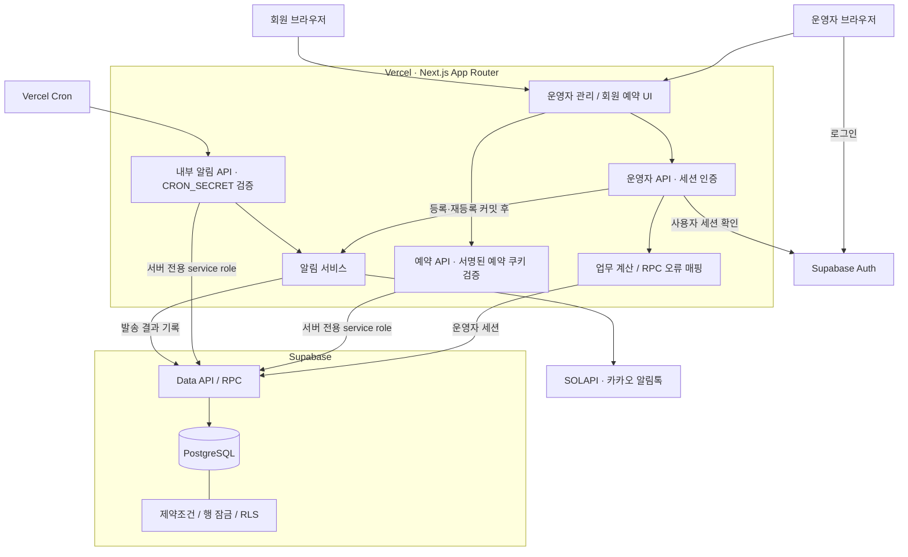
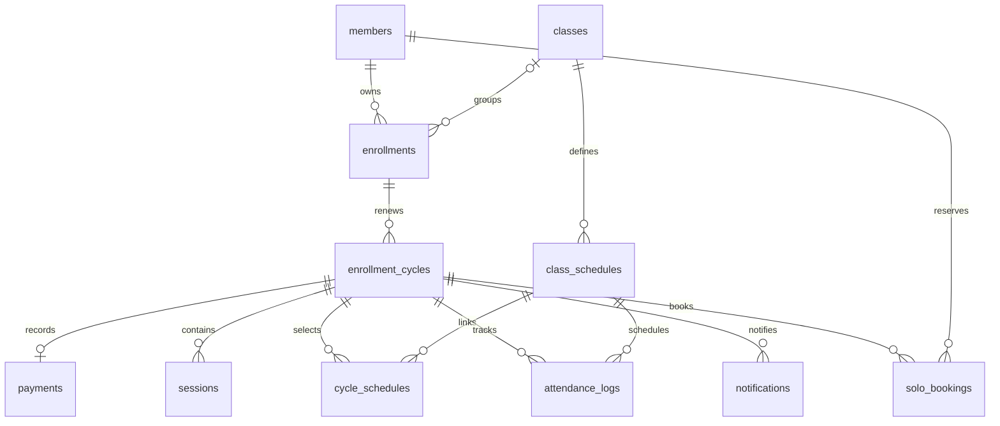

# Dance Studio Admin

**실제 댄스학원의 예약·출석·수강권·재등록 업무를 관리하는 운영 서비스**

종이표와 카카오톡으로 나뉘어 있던 업무를 하나의 시스템으로 옮기고, 회원별 수강 시작일·유효기간·잔여 회차를 관리합니다. 운영자와 요구사항을 정리하고 AI와 함께 구현한 뒤, 실제 사용 과정의 피드백을 받아 데이터 모델과 업무 흐름을 개선하고 있습니다.

- **개발·운영:** 2026.07 ~ 현재
- **담당 범위:** 요구사항 분석, 데이터·API 설계, 구현, 배포, 운영 피드백 반영
- **현재 범위:** 단일 사업장·단일 운영자, 운영자 관리 화면과 회원 예약 화면
- **주요 기술:** Next.js 15 · TypeScript · Supabase Auth · PostgreSQL · SOLAPI · Vercel

[시스템 아키텍처](#시스템-아키텍처) · [핵심 설계와 개선 과정](#핵심-설계와-개선-과정) · [테스트](#테스트) · [로컬 실행](#로컬-실행) · [개선 과제](#개선-과제)

## 해결하려는 문제

운영자는 회원 신청서, 종이 출석표, 카카오톡, 계좌 내역을 각각 확인해야 했습니다. 개인레슨 예약은 메시지를 주고받으며 조율했고, 구두로 정한 시간을 회원이 다르게 기억해 일정이 겹친 사례도 있었습니다. 회원마다 수강 시작일이 달라 유효기간과 재등록 시점을 개별적으로 계산해야 했습니다.

| 기존 업무의 문제 | 시스템에서의 처리 |
| --- | --- |
| 운영자와 회원이 가능한 시간을 반복해서 조율 | 운영자가 차단 시간을 등록하고, 회원이 가능한 시간에 직접 예약 |
| 회원별 유효기간·잔여 회차를 종이와 캘린더로 확인 | 수강 주기별 회차·기간을 계산하고 운영자와 회원에게 표시 |
| 출석·결제·재등록 내역이 여러 곳에 분산 | 회원 → 수강 관계 → 구매 주기를 기준으로 이력 연결 |
| 결제 대상 확인과 남은 회차 안내를 반복 | 홈 화면에서 대상 확인, SOLAPI 알림톡으로 안내 |

### 실제 운영에서 확인한 변화

2026년 9월 운영자 인터뷰 기준, 회원이 **15명에서 70명으로 증가한 환경에서도 1인 운영**에 사용하고 있습니다. 운영자는 예약 조율과 기간 계산 부담이 줄었고, 관리 인력 채용을 고려하다 보류했다고 설명했습니다.

이는 **운영자 인터뷰에 근거한 사용 성과**입니다. 회원 증가를 서비스 도입의 단독 효과로 해석하지 않으며, 업무 시간 절감률·매출 증가율은 측정하지 않았습니다.

## 시스템 아키텍처

현재 구현은 **Next.js 애플리케이션과 PostgreSQL을 중심으로 한 단일 서비스 구조**입니다. HTTP 요청·인증·외부 서비스 연동은 애플리케이션에서 처리하고, 여러 테이블을 함께 변경하는 핵심 업무는 PostgreSQL RPC에 트랜잭션 경계를 둡니다.



### 책임과 신뢰 경계

| 영역 | 책임 | 구현 근거 |
| --- | --- | --- |
| Route Handlers | 요청 처리, 입력 확인, HTTP 응답, 업무 호출 | [API 디렉터리](src/app/api) |
| 공통 업무 로직 | 한국 날짜·기간·회차 계산, 예약 규칙, RPC 오류 매핑 | [business-rules.ts](src/lib/business-rules.ts), [booking-rules.ts](src/lib/booking-rules.ts), [enrollment-service.ts](src/lib/enrollment-service.ts) |
| PostgreSQL RPC | 수강권·주기·회차·결제 등 복수 행 변경의 원자성 | [마이그레이션](supabase/migrations) |
| 운영자 인증 | Supabase Auth 세션 확인, 비인증 API 요청에 JSON 401 반환 | [middleware.ts](src/middleware.ts) |
| 회원 예약 인증 | 이름·전화번호 조회 후 별도 서명 쿠키 발급·검증 | [예약 로그인](src/app/api/booking/login/route.ts), [booking-session.ts](src/lib/booking-session.ts) |
| 외부 알림 | 메시지 구성, SOLAPI 요청, 발송 결과 기록 | [notification-service.ts](src/lib/notification-service.ts), [solapi.ts](src/lib/solapi.ts) |

운영자 API는 사용자 세션을 전달해 RLS를 적용합니다. 회원 예약·스케줄러 등 service role을 사용하는 서버 경로는 RLS를 우회하므로 해당 경로의 인증·대상 검증이 중요합니다. 현재 RLS는 인증된 운영자 간 사업장 격리를 제공하지 않습니다.

별도 메시지 브로커나 독립 워커는 없습니다. 등록·재등록 알림은 DB 커밋 이후 요청 경로에서 실행하며, 정기 안내는 Cron이 처리합니다. 이 구조는 운영 구성 요소를 줄이는 대신 외부 발송의 지연·재시도·복구를 애플리케이션이 다뤄야 합니다.

## 데이터 모델

`enrollments`는 회원의 수강 관계, `enrollment_cycles`는 구매·재등록 주기를 표현합니다. 이전 주기를 덮어쓰지 않고 회차와 결제 기록을 해당 주기에 연결합니다.



핵심 관계를 생략·요약한 다이어그램입니다. 예약 차단 구간은 별도 `solo_booking_blocks` 테이블에 저장합니다. 정확한 컬럼과 최종 제약조건은 [전체 마이그레이션](supabase/migrations)의 적용 결과를 기준으로 합니다.

결제 기능은 수강료 **결제 기록·재등록 이력 관리**이며, PG 자동 청구·정산 시스템을 의미하지 않습니다. 단체반에는 정원 제한이 없습니다.

## 핵심 설계와 개선 과정

### 1. 회차 누적에서 구매 주기 분리로 재등록 모델 변경

**문제:** 기존 주기에 회차를 계속 더하면 이전 구매의 수업·결제 이력과 새 구매의 사용량을 구분하기 어렵습니다.

**선택:** 개인레슨 재등록 시 기존 주기를 완료 처리하고, 미사용 회차만 이월한 새 주기를 생성합니다. 이전 회차·결제 기록은 기존 주기에 남깁니다.

**트랜잭션 경계:** 수강 관계와 활성 주기를 `FOR UPDATE`로 잠그고, 기존 주기 종료 → 새 주기 생성 → 회차 생성 → 결제 기록 생성을 하나의 RPC로 처리합니다. 중간 실패 시 일부 데이터만 저장되지 않도록 합니다.

**Trade-off:** 애플리케이션의 여러 DB 요청보다 원자성이 명확하지만, SQL 함수에도 업무 규칙이 있으므로 마이그레이션과 DB 통합 테스트를 함께 관리해야 합니다. 행 잠금은 동일 HTTP 요청의 재시도까지 멱등하게 만들지는 않습니다.

근거: [재등록 RPC](supabase/migrations/0020_restore_solo_renewal_cycles.sql), [호출 API](src/app/api/enrollments/[id]/cycles/route.ts), [회귀·롤백 테스트](tests/integration/database.test.ts).

### 2. 예약 겹침을 애플리케이션 검사와 DB 제약으로 방어

**문제:** 예약 가능 여부를 조회한 뒤 저장하는 방식만으로는 서로 다른 요청이 같은 시간대를 동시에 예약할 수 있습니다. 예약 생성과 운영자 차단 시간 생성도 경합할 수 있습니다.

**선택:** 개인 예약의 날짜·시간 범위에 GiST 배제 제약조건을 적용하고, 예약과 차단 시간 생성에 같은 날짜 단위 transaction advisory lock을 사용합니다. 수강 주기 상태 확인에는 행 잠금을 사용합니다.

**Trade-off:** 데이터 저장 시점에 겹침을 방어할 수 있지만 같은 날짜의 관련 요청을 직렬화합니다. 현재 예약 자원 모델을 전제로 하며, 여러 강사를 지원할 때는 자원 식별자와 잠금 범위를 다시 설계해야 합니다.

근거: [예약 테이블·배제 제약](supabase/migrations/0008_solo_bookings.sql), [차단 시간·공유 잠금](supabase/migrations/0022_solo_booking_blocks.sql).

### 3. 재등록 완료와 외부 알림 실패를 분리

**문제:** 수강 등록과 외부 메시지 발송은 하나의 DB 트랜잭션으로 묶을 수 없습니다. 메시지 제공자의 장애 때문에 완료된 등록까지 취소되어서는 안 됩니다.

**현재 구현:** 등록·재등록 DB 작업이 완료된 뒤 SOLAPI 알림톡을 요청하고, 제공자 응답과 성공·실패 이력을 저장합니다. 발송 기록은 주기·알림 유형별로 제한하며, 기존 성공 기록은 재발송하지 않습니다. Cron 경로에는 조건부 상태 변경으로 작업을 선점하는 처리가 있습니다.

**현재 한계:** 기록의 중복 제한은 외부 발송의 정확히 한 번 실행을 보장하지 않습니다. 동시 수동 호출, 발송 후 기록 저장 실패, `processing` 상태에서 작업 종료 시의 재처리·복구는 보완 과제입니다.

근거: [알림 서비스](src/lib/notification-service.ts), [Cron 경로](src/app/api/internal/notifications/run/route.ts), [알림 이력 스키마](supabase/migrations/0006_real_notification_delivery.sql).

## 주요 API

전체 경로는 [src/app/api](src/app/api)에서 확인할 수 있습니다.

| 영역 | 대표 경로 | 역할 |
| --- | --- | --- |
| 회원 | `/api/members` | 회원 조회·등록 |
| 수강 | `/api/enrollments` | 수강 등록 |
| 재등록 | `/api/enrollments/[id]/cycles` | 주기 이력 조회·재등록 |
| 개인레슨 | `/api/cycles/[cycleId]/sessions` | 회차 관리 |
| 단체레슨 | `/api/attendance` | 출석 관리 |
| 회원 예약 | `/api/booking/login`, `/api/booking` | 예약 세션 발급·예약 |
| 운영자 일정 | `/api/bookings`, `/api/booking-blocks` | 예약 조회·차단 시간 관리 |
| 결제 기록 | `/api/payments/[id]/refund` | 환불 기록 처리 |
| 정기 안내 | `/api/internal/notifications/run` | 인증된 Cron 요청 처리 |

## 저장소 구조

```text
src/
├── app/
│   ├── (app)/          # 운영자 화면
│   ├── booking/        # 회원 예약 화면
│   ├── login/          # 운영자 로그인
│   └── api/            # HTTP 요청 경계
├── components/         # 공통 UI
├── lib/                # 업무 계산, 인증, DB·SOLAPI 연동
└── middleware.ts       # 운영자 세션과 접근 제어
supabase/migrations/    # 스키마, 제약조건, RLS, 업무 RPC 변경 이력
tests/
├── unit/               # 순수 계산·입력·외부 연동 모킹
├── integration/        # 실제 테스트 DB의 RPC·정합성 검증
├── e2e/                # Playwright 사용자 흐름
└── support/            # 테스트 환경 검증·seed manifest
scripts/                # 테스트 데이터·알림 설정 점검
```

## 테스트

| 계층 | 확인 대상 | 실행 |
| --- | --- | --- |
| 단위 | 한국 날짜, 유효기간, 잔여 회차, 예약 규칙, 입력, SOLAPI 모킹 | `npm run test` |
| 통합 | 수강·재등록·출석·예약, 이전 이력 보존, 실패 시 롤백 | `npm run test:integration` |
| E2E | 로그인, 회원·수강 관리 등 UI 흐름 | `npm run test:e2e` |
| 정적 검사 | TypeScript·ESLint | `npm run typecheck`, `npm run lint` |

2026-09-22 로컬 확인에서 단위 테스트 **52개**, 타입 검사, 린트가 통과했습니다. 이 결과는 통합·E2E·운영 환경 검증을 포함하지 않습니다. 예약 중복·겹침 테스트와 별도로, 실제 요청을 병렬 실행하는 경쟁 상태 검증을 보강할 예정입니다.

통합 테스트는 테스트 DB 설정이 없으면 DB 시나리오를 건너뛸 수 있습니다. 종료 코드만으로 성공을 판단하지 않고 실제 실행·skip 항목을 확인해야 합니다.

### 테스트 데이터 안전 원칙

- 기본 대상은 Docker 기반 로컬 Supabase입니다. 운영 DB에는 테스트·seed를 실행하지 않습니다.
- 테스트 설정은 `.env.test.local`에 분리합니다. E2E 앱에도 로컬 DB 값이 전달되는지 확인합니다.
- 로컬 URL과 `TEST_MODE=true`, `TEST_SUPABASE_PROJECT_REF=local`을 사용합니다.
- 원격 테스트는 명시적으로 허용한 별도 프로젝트만 사용합니다. ref 일치 검사는 운영 DB가 아니라는 증명 자체는 아닙니다.
- 실제 회원 정보를 사용하지 않습니다. seed 생성 ID는 manifest에 기록하고 해당 실행 데이터만 정리합니다.

근거: [테스트 환경 검증](tests/support/test-env.ts), [Playwright 설정](playwright.config.ts), [seed manifest](tests/support/seed-manifest.ts).

## 로컬 실행

### 1. 의존성과 로컬 DB 준비

Node.js는 `package.json`의 범위(`>=20 <23`)에 맞춰 사용합니다. DB 통합 테스트에는 Docker가 필요합니다.

```bash
npm ci
npx supabase start
cp .env.example .env.local
```

로컬 Supabase의 URL·키를 `.env.local`에 설정합니다. 운영 환경변수를 복사하지 않습니다. 개발용 운영자 계정은 로컬 Supabase Studio의 Authentication에서 생성합니다.

기존 로컬 DB를 새로 구성해야 한다면, 데이터를 버려도 되는 **로컬 인스턴스임을 확인한 뒤** `npx supabase db reset`으로 마이그레이션을 적용합니다. 운영 DB에 초기 마이그레이션을 재실행하지 않습니다.

### 2. 환경변수

실제 값은 커밋하지 않습니다. 변수 목록은 [.env.example](.env.example)을 기준으로 합니다.

| 용도 | 변수 |
| --- | --- |
| Supabase 클라이언트 | `NEXT_PUBLIC_SUPABASE_URL`, `NEXT_PUBLIC_SUPABASE_ANON_KEY` |
| 서버 전용 DB 접근 | `SUPABASE_SERVICE_ROLE_KEY` |
| 예약 쿠키 서명 | `BOOKING_SESSION_SECRET` |
| Cron 인증 | `CRON_SECRET` |
| SOLAPI 인증 | `SOLAPI_API_KEY`, `SOLAPI_API_SECRET` |
| 카카오 발신 정보 | `KAKAO_CHANNEL_ID`, `KAKAO_SENDER_PHONE` |
| 알림 템플릿 | `KAKAO_DUE_SOLO_TEMPLATE_ID`, `KAKAO_DUE_GROUP_TEMPLATE_ID`, `KAKAO_COMPLETED_SOLO_TEMPLATE_ID`, `KAKAO_COMPLETED_GROUP_TEMPLATE_ID` |
| 발송 활성화 | `NEXT_PUBLIC_NOTIFICATIONS_ENABLED` |

SOLAPI 실제 발송은 구현되어 있습니다. 로컬 기본 설정은 오발송 방지를 위해 발송을 비활성화합니다. 서버 전용 키에는 `NEXT_PUBLIC_` 접두사를 붙이지 않습니다.

```bash
npm run dev
```

운영자 화면은 `http://localhost:3000/login`, 회원 예약 화면은 `/booking`에서 시작합니다.

### 3. 로컬 DB 테스트

[.env.test.local.example](.env.test.local.example)을 복사하고 로컬 DB 값과 테스트 전용 계정을 설정합니다. 다음 계정 생성 명령도 대상이 localhost인지 확인한 뒤 실행합니다.

```bash
cp .env.test.local.example .env.test.local
# 로컬 URL·키, TEST_MODE=true, TEST_SUPABASE_PROJECT_REF=local,
# 테스트 전용 이메일·비밀번호 설정 후 실행
TEST_MODE=true npx tsx scripts/create-test-admin.ts
npx playwright install chromium
npm run test:integration
npm run test:e2e
```

별도 seed가 필요할 때는 `npm run test:seed`를 사용합니다. `npm run test:cleanup -- <runId>`는 해당 실행의 manifest에 기록된 데이터만 정리합니다.

## 배포와 운영

- 애플리케이션은 Vercel, 인증·DB는 Supabase, 알림은 SOLAPI를 사용합니다.
- [vercel.json](vercel.json)의 Cron은 UTC `20:00`, 한국 시간 기준 다음 날 `05:00`에 실행하도록 설정되어 있습니다.
- 운영 배포 전 타입 검사·린트·테스트·빌드와 마이그레이션 적용 상태를 확인합니다. 운영자 로그인·회원 조회·수강·출석·재등록·로그아웃을 배포 후 점검합니다.
- `npm run notifications:check`는 알림 환경변수의 누락·예시 값·템플릿 구성을 검사합니다. 실제 값을 출력하거나 발송 요청을 보내지 않습니다.
- 운영 환경에는 테스트 계정·로컬 DB URL을 등록하지 않습니다.
- 저장소에 CI 파이프라인, 운영 지표·경보, 복구 절차의 자동화가 모두 갖춰진 상태는 아닙니다.

## 개선 과제

아래는 **구현 완료 성과와 구분한 후속 과제**입니다.

| 우선순위 | 과제 | 검증할 결과 |
| --- | --- | --- |
| 1 | 재등록 요청의 멱등성 | 동일 요청 재시도 시 새 주기·결제 기록이 추가되지 않음 |
| 1 | 예약·재등록 경쟁 상태 테스트 | 병렬 요청에서도 시간 겹침·이력 손상이 발생하지 않음 |
| 1 | 알림 작업의 재시도·중단 복구 | 발송 결과 불명확·기록 실패·처리 중 종료를 구분하고 복구 가능 |
| 1 | 회원 예약 인증 정책 검토 | 이름·전화번호 조회의 한계를 정의하고 운영 편의성과 보호 수준을 합의 |
| 2 | CI 및 관측 가능성 | 격리 DB 회귀 검사, 구조화 로그, 실패 지표·경보, 복구 실습 |
| 2 | 단체레슨 회차·유효기간별 안내 | 운영자와 임계값·우선순위·중복 안내 정책을 합의한 뒤 검증 |
| 3 | 다중 사업장 지원 | 실제 추가 고객 요구를 기준으로 `studio_id`·권한·RLS 데이터 격리 설계 |

알림에는 DB Outbox를 검토할 수 있지만, 외부 제공자가 발송을 접수한 뒤 응답을 잃는 상황은 로컬 트랜잭션만으로 해결되지 않습니다. 제공자의 상태 조회·중복 방지 지원과 함께 재처리 정책을 결정해야 합니다.

현재 구조를 유지하면서 실제 오류를 재현하고, 설계 변경을 테스트와 운영 결과로 설명할 수 있게 만드는 것을 우선합니다.
