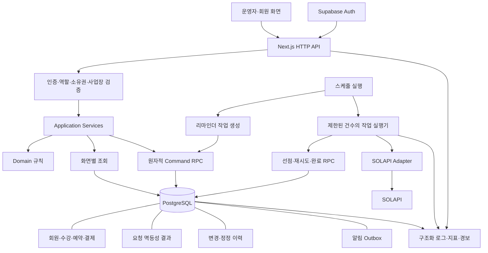

<div align="center">

# Elanor Academy

**실제 학원에서 운영 중인 예약·수강 관리 서비스**

회원의 예약부터 출석, 수강권 유효기간, 재등록 안내까지 연결합니다.

https://elanoracademy.com/booking

[아키텍처](#architecture) · [설계와 문제 해결](#engineering) · [개발 환경](docs/DEVELOPMENT.md)

</div>

---

## Overview

종이 출석표와 카카오톡으로 회원을 관리하던 1인 댄스학원의 업무를 시스템화한 프로젝트입니다. 실제 운영자와 요구사항을 정리하고, AI를 활용해 구현한 뒤 운영 피드백에 따라 예약 흐름과 수강 데이터 모델을 개선하고 있습니다.

| 항목 | 내용 |
| :--- | :--- |
| 개발 기간 | 2026.07 ~ 현재 |
| 담당 | 요구사항 분석 · DB/API 설계 · 구현 · 배포 · 유지보수 |
| 운영 범위 | 단일 사업장·운영자, 회원 예약 페이지 |
| 사용 현황 | 회원 70명 규모의 학원에서 실제 사용 중 |

운영자는 가능한 시간을 반복해서 조율하는 대신 예약을 확인하고, 회원별 시작일에 따른 유효기간과 잔여 회차를 시스템에서 관리합니다. 회원이 15명에서 70명으로 늘어난 상황에서도 1인 운영을 이어가고 있으며, 운영자 인터뷰에서 행정 부담 감소와 관리 인력 채용 보류를 확인했습니다.

<sub>사용 현황과 업무 변화는 2026년 9월 운영자 인터뷰 기준입니다. 회원 증가의 인과 효과나 시간 절감률을 측정한 수치는 아닙니다.</sub>

## Features

| 운영자 | 회원 |
| :--- | :--- |
| 회원·수강권 등록 및 이력 관리 | 개인레슨 가능 시간 조회·예약 |
| 개인레슨 일정 확인·예약 차단 | 예약 내역 확인·취소 |
| 개인레슨 회차·단체레슨 출석 관리 | 수강권 잔여 회차·기간 확인 |
| 결제·재등록 대상 확인 및 기록 관리 | 카카오 알림톡 안내 수신 |

- 개인레슨 4·8·12회권과 회원별 수강 주기를 관리합니다.
- 단체레슨은 복수 요일 등록을 지원하며 정원 제한이 없습니다.
- SOLAPI 알림톡 실제 발송과 주기·알림 유형별 발송 이력 기록을 구현했습니다.
- 결제 기능은 수강료 기록 관리이며, PG 결제 승인·자동 청구 기능은 포함하지 않습니다.

## Tech Stack

| 영역 | 기술 |
| :--- | :--- |
| Application | Next.js 15 · React 18 · TypeScript |
| Database & Auth | Supabase · PostgreSQL · Supabase Auth · RLS |
| Notification | SOLAPI Kakao AlimTalk |
| Deployment | Vercel · Vercel Cron |
| Testing | Vitest · Playwright · Docker 기반 로컬 Supabase |

## Architecture

현재는 **Next.js Route Handlers → Supabase Data API/RPC → PostgreSQL** 구조로 운영합니다. 운영자는 Supabase Auth, 회원 예약은 별도의 서명 쿠키를 사용합니다. 여러 테이블의 변경은 DB RPC로 묶고, 등록·재등록 알림은 커밋 후 SOLAPI를 호출합니다. 정기 안내는 Vercel Cron으로 실행합니다.

### 목표 아키텍처

기존 스택을 유지하면서 **모듈형 모놀리스와 영속적인 알림 작업 처리**로 발전시키는 설계입니다. 아래는 앞서 수립한 개선 목표이며, 전체가 구현된 상태를 의미하지 않습니다.



| 구현된 기반 | 후속 구현 |
| :--- | :--- |
| Next.js API, Supabase Auth, 업무 계산 함수 | Application·Domain 계층의 모듈별 책임 정리 |
| PostgreSQL 원자적 RPC, 제약조건·잠금 | 요청 멱등성 결과·변경 이력의 일관된 관리 |
| SOLAPI 발송, 발송 이력, Cron 선점 처리 | Outbox, 재시도·선점 만료·중단 복구 |
| 단일 운영자 접근 제어 | 사업장별 권한·데이터 격리, 로그·지표·경보 |

프레임워크를 교체하기보다 현재 서비스의 트랜잭션·재시도·장애 복구 문제를 먼저 해결합니다. 외부 발송을 DB 트랜잭션 밖으로 분리하고, 업무 변경과 발송 작업 저장을 원자적으로 묶는 것이 알림 개선의 핵심입니다.

## Engineering

### 01. 재등록을 ‘회차 누적’에서 ‘구매 주기’로 분리

동일 수강권에 회차를 계속 더하면 이전 구매의 사용 이력과 새 구매의 이용 권리를 구분하기 어렵습니다. 개인레슨 재등록 시 기존 주기를 완료하고 **미사용 회차만 이월한 새 주기**를 생성하도록 변경했습니다.

```text
회원 (members)
└── 수강 관계 (enrollments)
    ├── 이전 구매 주기 (completed) → 이전 회차·결제 이력 보존
    └── 새 구매 주기 (active)      → 새 이용권 + 잔여 회차 이월
```

수강 관계와 활성 주기를 `FOR UPDATE`로 잠그고, **기존 주기 종료 → 새 주기·회차 생성 → 결제 기록**을 단일 RPC 트랜잭션으로 처리합니다. SQL에도 업무 규칙이 있으므로 마이그레이션과 DB 통합 테스트를 함께 관리합니다.

[재등록 RPC](supabase/migrations/0020_restore_solo_renewal_cycles.sql) · [API](src/app/api/enrollments/[id]/cycles/route.ts) · [이력 보존·롤백 테스트](tests/integration/database.test.ts)

### 02. 예약과 운영자 차단 시간의 충돌을 DB에서 제어

예약 가능 시간을 확인한 뒤 저장하는 애플리케이션 검사만으로는 동시 요청의 충돌을 막을 수 없습니다. 개인 예약의 날짜·시간 범위에는 **GiST 배제 제약조건**을 적용하고, 예약 생성과 차단 시간 생성에는 **같은 날짜 단위 advisory transaction lock**을 사용합니다.

같은 날짜의 관련 요청이 직렬화되는 비용을 수용한 설계입니다. 여러 강사를 지원할 때는 강사·공간 등 예약 자원별로 제약조건과 잠금 범위를 재설계해야 합니다.

[예약 겹침 제약](supabase/migrations/0008_solo_bookings.sql) · [예약·차단 시간 잠금](supabase/migrations/0022_solo_booking_blocks.sql)

### 03. 등록 완료와 외부 알림 실패의 경계 분리

알림 제공자의 장애가 완료된 수강 등록을 취소하지 않도록 **DB 커밋 이후 발송**합니다. 제공자 응답을 발송 이력에 기록하고, Cron에서는 조건부 상태 변경으로 처리 대상을 선점합니다.

현재 발송 이력의 중복 제한은 외부 발송의 정확히 한 번 실행을 보장하지 않습니다. 발송 이후 기록 실패나 작업 중단을 복구하기 위한 Outbox·재시도는 후속 과제입니다.

[알림 서비스](src/lib/notification-service.ts) · [SOLAPI 연동](src/lib/solapi.ts) · [Cron](src/app/api/internal/notifications/run/route.ts)

## Testing

| 계층 | 검증 대상 | 명령 |
| :--- | :--- | :--- |
| Unit | 날짜·유효기간·회차 계산, 예약 규칙, 입력 검증, SOLAPI 모킹 | `npm run test` |
| Integration | 실제 테스트 DB의 등록·재등록·예약·출석, 이력 보존·롤백 | `npm run test:integration` |
| E2E | 운영자 로그인·회원·수강 관리 흐름 | `npm run test:e2e` |
| Static | TypeScript·ESLint | `npm run typecheck` / `npm run lint` |

**2026-09-22 확인:** 단위 테스트 52개·타입 검사·린트 통과. 통합·E2E는 이 확인에 포함하지 않았습니다. 테스트는 운영 DB와 분리하며, 실제 병렬 요청에 대한 경쟁 상태 검증을 보강할 예정입니다.

## Getting Started

Node.js `>=20 <23`, npm, Docker가 필요합니다.

```bash
npm ci
npx supabase start
cp .env.example .env.local
# 로컬 Supabase URL·키와 예약 세션 키 설정
npm run dev
```

운영자 로그인은 `http://localhost:3000/login`, 회원 예약은 `/booking`에서 시작합니다. 개발용 운영자 계정 생성, 환경변수, DB 테스트 방법은 [개발 가이드](docs/DEVELOPMENT.md)를 참고하세요.

## Roadmap

- [ ] 재등록 요청 멱등성 및 병렬 요청 회귀 테스트
- [ ] 알림 Outbox·재시도·중단 작업 복구
- [ ] 회원 예약 인증 정책 보완
- [ ] 격리 DB 기반 CI, 구조화 로그·운영 지표·경보
- [ ] 단체레슨 잔여 회차·유효기간별 알림 정책
- [ ] 추가 사업장 도입 시 테넌트별 데이터 격리

현재 RLS는 인증된 운영자 간 사업장 격리를 제공하지 않습니다. 다중 사업장 지원은 후속 확장 범위입니다.
